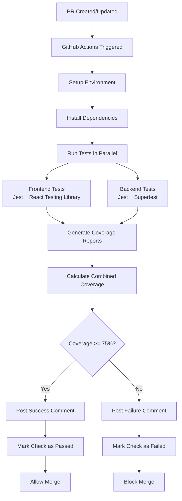

# Design Document

## Overview

This design implements a comprehensive GitHub Actions CI/CD pipeline that enforces a 75% test coverage threshold on pull requests. The system will automatically run tests for both frontend (React) and backend (Node.js/Express) components, generate detailed coverage reports, and provide actionable feedback through PR comments while preventing merges that don't meet quality standards.

## Architecture

### High-Level Flow



### Workflow Architecture

The pipeline consists of three main GitHub Actions workflows:

1. **PR Coverage Check** (`pr-coverage.yml`) - Main workflow triggered on PR events
2. **Coverage Comment** (`coverage-comment.yml`) - Handles PR comment updates
3. **Emergency Bypass** (`emergency-bypass.yml`) - Manual workflow for critical fixes

## Components and Interfaces

### 1. GitHub Actions Workflows

#### PR Coverage Workflow
- **Trigger**: Pull request events (opened, synchronize, reopened)
- **Jobs**: 
  - `test-frontend` - React application testing
  - `test-backend` - Node.js API testing
  - `coverage-report` - Combine and analyze coverage
  - `comment-pr` - Update PR with results

#### Coverage Analysis Engine
- **Input**: Coverage reports from both frontend and backend
- **Processing**: Combines coverage data, calculates overall percentage
- **Output**: Structured coverage data for reporting

#### PR Comment Manager
- **Functionality**: Creates/updates PR comments with coverage details
- **Features**: 
  - Diff highlighting for under-covered files
  - Coverage trend comparison
  - Actionable recommendations

### 2. Testing Infrastructure

#### Frontend Testing Setup
- **Framework**: Jest (built into Create React App)
- **Coverage**: Built-in Jest coverage with lcov reporter
- **Configuration**: Custom coverage thresholds and exclusions

#### Backend Testing Setup
- **Framework**: Jest with Supertest for API testing
- **Coverage**: Jest coverage with lcov reporter
- **Database**: In-memory SQLite for test isolation

### 3. Coverage Reporting System

#### Report Generation
- **Format**: LCOV, JSON, and HTML reports
- **Storage**: GitHub Actions artifacts
- **Retention**: 30 days minimum

#### Coverage Calculation
- **Method**: Line coverage percentage
- **Scope**: Combined frontend and backend coverage
- **Threshold**: 75% minimum overall coverage

## Data Models

### Coverage Report Structure
```typescript
interface CoverageReport {
  overall: {
    lines: { total: number; covered: number; percentage: number };
    functions: { total: number; covered: number; percentage: number };
    branches: { total: number; covered: number; percentage: number };
    statements: { total: number; covered: number; percentage: number };
  };
  files: Array<{
    path: string;
    lines: { total: number; covered: number; percentage: number };
    uncoveredLines: number[];
  }>;
  frontend: CoverageData;
  backend: CoverageData;
}
```

### PR Comment Data
```typescript
interface PRCommentData {
  coveragePercentage: number;
  previousCoverage?: number;
  coverageDelta: number;
  status: 'passed' | 'failed';
  underCoveredFiles: Array<{
    path: string;
    coverage: number;
    threshold: number;
  }>;
  recommendations: string[];
}
```

## Error Handling

### Test Execution Failures
- **Strategy**: Fail fast with clear error messages
- **Logging**: Detailed logs in workflow output
- **Recovery**: Retry mechanism for flaky tests (max 2 retries)

### Coverage Calculation Errors
- **Fallback**: Individual component coverage if combined calculation fails
- **Validation**: Verify coverage report integrity before processing
- **Alerts**: Notify maintainers of calculation issues

### GitHub API Failures
- **Comment Updates**: Graceful degradation if comment posting fails
- **Status Checks**: Ensure check status is always set (pass/fail)
- **Rate Limiting**: Implement exponential backoff for API calls

## Testing Strategy

### Unit Testing
- **Frontend**: Component testing with React Testing Library
- **Backend**: Controller and service layer testing with Jest/Supertest
- **Coverage Tools**: Jest coverage analysis

### Integration Testing
- **API Testing**: Full request/response cycle testing
- **Database Testing**: SQLite in-memory database for isolation
- **Authentication**: JWT token validation testing

### End-to-End Testing
- **Scope**: Critical user flows (login, match upload, data viewing)
- **Tools**: Jest with Puppeteer for browser automation
- **Coverage**: Include E2E tests in coverage calculation

### Pipeline Testing
- **Workflow Validation**: Test GitHub Actions locally with act
- **Coverage Accuracy**: Verify coverage calculation correctness
- **Comment Formatting**: Test PR comment generation and updates

## Implementation Details

### File Structure
```
.github/
├── workflows/
│   ├── pr-coverage.yml
│   ├── coverage-comment.yml
│   └── emergency-bypass.yml
├── scripts/
│   ├── combine-coverage.js
│   ├── generate-comment.js
│   └── setup-tests.js
└── templates/
    └── coverage-comment.md
```

### Environment Configuration
- **Node.js Version**: 18.x (LTS)
- **Cache Strategy**: npm cache for dependencies
- **Parallel Execution**: Frontend and backend tests run simultaneously
- **Timeout**: 10 minutes maximum per job

### Branch Protection Rules
- **Required Checks**: "Coverage Check" must pass
- **Admin Override**: Disabled (enforces coverage for all users)
- **Dismiss Stale Reviews**: Enabled when new commits pushed
- **Require Up-to-date**: Enabled to ensure latest code is tested

### Security Considerations
- **Token Permissions**: Minimal required permissions for GitHub token
- **Secret Management**: Use GitHub secrets for sensitive configuration
- **Dependency Security**: Automated security scanning in pipeline
- **Code Injection**: Sanitize all user inputs in coverage comments

### Performance Optimizations
- **Caching**: Node modules cached between runs
- **Parallel Jobs**: Frontend/backend tests run concurrently
- **Incremental Testing**: Only test changed files when possible
- **Resource Limits**: Appropriate memory and CPU limits set

### Monitoring and Observability
- **Workflow Metrics**: Track pipeline success rates and duration
- **Coverage Trends**: Historical coverage data analysis
- **Alert System**: Notify team of pipeline failures or coverage drops
- **Dashboard**: Coverage metrics visualization (future enhancement)